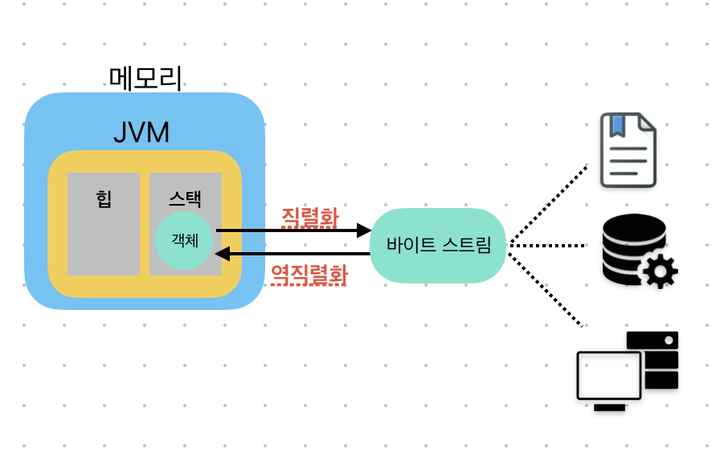

# TIL Template

## 날짜: 2025-02-07

### 스크럼
- 학습 목표 1 : 딥다이브 정리

### 새로 배운 내용
#### 📍 추상클래스와 인터페이스에 대해 설명해주세요.
- 정의  
  - `추상클래스` : 하위 클래스들의 공통점을 모아 추상화시킨, 하나 이상의 추상 메서드를 포함하는 클래스
  - `인터페이스` : 클래스가 구현할 동작의 명세를 정의하는, 모든 메서드가 추상 메서드로 선언된 클래스  
  
- 사용이유
  - `추상클래스` : 하위 클래스들이 `공통기능`은 구현하고, 각자 필요한 `확장` 을 지원하기 위해
  - `인터페이스` : 서로 다른 클래스들의 `공통기능`을 정의하거나 `다중 상속`을 지원하기 위해

- 언제 사용되나요?
  - `추상클래스`
    - 중복 멤버 통합: 클래스들 간 연관 관계가 있어 공통을 가지는 메소드와 필드가 많을 때  
      → 특히 인터페이스에서 선언된 변수는 모두 상수이기 때문에, 클래스들이 공통의 멤버 변수를 가져야하는 경우 추상 클래스를 사용
    - 공통 동작은 제공하되, 특정 동작은 하위 클래스에게 강제

  - `인터페이스`
    - 상속 관계에 얽매이지 않고, 공통 기능만 구현시키도록 할 때
    - 다중 구현: 다양한 기능을 조합하여 설계할 때

→ 추상 클래스와 인터페이스는 추상 메소드를 강제로 구현하도록 하여, 추상적인 설계와 구체적인 구현을 분리하는 공통적인 기능이 있습니다. 하지만, 세부사항과 사용목적에 차이가 있습니다.

- 추상클래스
    - `extends` 키워드. 공통 기능을 구현하면서 확장시키는 목적
    - 상속받는 클래스와 **부모-자식 관계**가 형성
- 인터페이스
    - `implements` 키워드. 동일한 동작을 보장하는 목적
    - 계층 관계 형성되지 않고 독립적

#### 📍 Java 직렬화(Serialization)와 역직렬화(Deserialization)에 대해 서술하시오
- 정의
  - `직렬화` : 메모리 상의 자바 Object나 Data를 바이트 스트림 형태로 변환하는 기술
  - `역직렬화` : 바이트 스트림을 메모리 상의 Object나 Data로 복구하는 기술

- 사용이유
  - `직렬화` : 객체와 데이터를 파일이나 데이터베이스에 저장하거나 네트워크를 통해 전송하기 위하여 사용
  - `역직렬화` : 직렬화된 데이터를 다시 객체나 데이터로 복원하여, 프로그래밍 언어가 사용할 수 있도록 하기 위해 사용

- 언제 사용되나요?  
  → 객체 데이터 저장 및 송수신
  - 자바 RMI (Remote Method Invocation): 원격 시스템간의 메세지 교환에 사용되는 자바 기술. 객체 데이터를 직렬화하여 메세지에 포함 시킨다.
  - 서블릿 세션(Servlet Session) : 세션 데이터를 저장&공유
  - 캐시 (Cache) - 캐시에 데이터베이스에서 조회해온 데이터의 객체가 있다. 이 데이터를 다른 모듈에서 필요할 때, 데이터베이스를 다시 조회하는 것이 아니라 객체를 직렬화하여 메모리에 저장해두고 필요할 때 다시 역직렬화 하여 사용

- 시스템 상의 동작  
  
- 사용방법  
  → `Serializable` 인터페이스를 implements !

### 오늘의 회고
- 두번째 딥다이브 시간이었는데, 확실히 파트를 분배하니 집중하기 조금 더 좋았던 것 같다 

