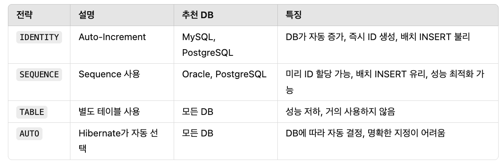

# TIL Template

## 날짜: 2025-03-18

### 스크럼
- 학습 목표 1 : JPA 학습
- 학습 목표 2 : 커뮤니티 백엔드 개발 
  - dto, controller, service 생성

### 새로 배운 내용

**📍 ORM(Object-Relational Mapping)**
: 객체지향 프로그래밍 언어에서 사용하는 객체를, 관계형 데이터베이스(테이블)와 자동으로 매핑해주는 기술

`장점`
- SQL을 직접 작성하지 않아도, 객체를 조작하면 JPA가 쿼리를 자동 생성
- JDBC 코드와 매핑 로직이 사라져, 비즈니스 로직에 집중할 수 있다
- 테이블 스키마 변경 시, 엔티티 매핑만 수정 → 코드 영향도가 낮아 유지보수성 좋음

`단점`
- 복잡한 쿼리를 쓸때는 오히려 어려워져서, 그냥 native query 사용
- 중간 매핑 처리 작업이 있어 약간 느림. 대량의 데이터, 복잡한 연산 등에서도 성능 문제

 

**📍 JPA(Java Persistence API)**

: Java 플랫폼을 위한 ORM 기술 표준 명세(인터페이스)  
- 엔티티와 테이블 간 매핑 규칙  
- 영속성 컨텍스트 개념  
- 트랜잭션/쿼리 처리 방식  
등을 표준화하며, 인터페이스의 구현체인 `Hibernate`가 실제로 이를 수행

 

**📍 JPA 주요 어노테이션**

**엔티티 클래스 - 테이블과 매핑**

- `@Entity`: 클래스를 JPA 엔티티로 선언. DB 테이블과 매핑
- `@Table`: 엔티티와 매핑될 테이블 이름 지정 (생략 시 클래스 이름 사용)

**Primary Key 설정**

- `@Id`: 엔티티의 식별자 필드 지정
- `@GeneratedValue`: PK 생성전략 지정
  - **IDENTITY**: DB의 Auto-Increment 사용 (MySQL, PostgreSQL 등)
  - **SEQUENCE**: 시퀀스 오브젝트 (Oracle 등)
  - **AUTO**: 구현체가 DB에 따라서 결정

**엔티티 필드 설정**

- `@Column`: 엔티티 필드와 DB 컬럼 매핑
- `@Transient`: 해당 필드를 영속성 관리 대상에서 제외
- `@Enumerated`: 자바 Enum 타입을 데이터베이스에 저장
- `@Column`: 엔티티 필드와 DB 컬럼 매핑

**복합 값 타입**

- 복합값?  좌표값(x, y)처럼 여러가지 필드가 하나의 개념을 말할때
- `@Embeddable`: 복합 값 타입을 정의하는 클래스에 사용합니다.
- `@Embedded`: 엔티티 클래스에서 복합 값 타입을 사용하는 필드에 적용합니다.

`@MappedSuperclass`: 공통 매핑 정보를 상속받는 클래스에 제공

 

📍 **JPA, Hibernate, Spring Data JPA 관계**

`JPA` (Java Persistence API)
- 자바 표준 ORM 인터페이스 (명세, 즉 "룰"만 정의)
- JPA는 직접 동작하지 않으며, 구현체(Provider)가 필요함

`Hibernate`
- JPA의 구현체 중 하나 (JPA를 실제로 동작하게 만드는 라이브러리)
- JPA 명세를 따르면서 추가 기능도 제공
- 예: Hibernate는 JPA에서 제공하지 않는 HQL, 캐싱 기능을 추가 지원

`Spring Data JPA`
- JPA를 쉽게 사용할 수 있도록 도와주는 Spring 모듈
- JPA의 구현체(Hibernate)를 내부적으로 사용
- 인터페이스 기반의 Repository 기능 제공 (자동으로 쿼리 생성)

 

**📍  영속성 컨텍스트**

: 엔티티를 영구적으로 저장·관리하는 공간

- EntityManager(혹은 Spring Data JPA의 Repository 내부)에서 관리
  - **1차 캐시**: 동일 트랜잭션 내, 같은 PK 조회 시 DB 대신 캐시 사용
  - **변경 감지(Dirty Checking)**: 엔티티 수정 시 트랜잭션 커밋 시점에 `UPDATE` 자동 생성(DB에 반영)
  - **지연 로딩(Lazy Loading)**: 연관관계 엔티티를 필요 시점에 DB로부터 로딩
- 트랜잭션 범위 내에서 동작 (`@Transactional`)
  - 트랜잭션 종료 → 준영속 상태로 변환 → 1차 캐시 초기화

 

**📍 엔티티 생명주기**  
  비영속 → 영속 → 준영속 → 삭제
- 비영속(Transient)
  - 영속성 컨텍스트와 상관없는 객체
  - 단순히 `new` 로 생성한 객체
- 영속(Managed)
  - 영속 컨텍스트에 등록된 상태
  - `persist()` 으로 등록
- 준영속(Detached)
  - 영속 상태에서 분리됨
  - `em.detach(entity)`, `em.clear()`, 트랜잭션 종료 등
  - 더 이상 추적되지 않고, 데이터베이스와 분리 → 자유롭게 사용할 수 있는 이점도 있음
- 삭제(Removed)
  - `remove()`로 DB에서 삭제할 것을 요청된 상태
  - 커밋 시, 실제로 DB에 반영

### 오늘의 회고
- 오프라인 시작일 - 확실히 환경이 중요한 것 같다. 훨씬 집중이 잘 된다
- 오늘 카카오 현직자 엘비스와 멘토링을 진행하였다. 동기부여가 많이 되었다
- 프로젝트 진행할 때, 어떤 기술 스택을, 왜 선택했는지 알고 있자
