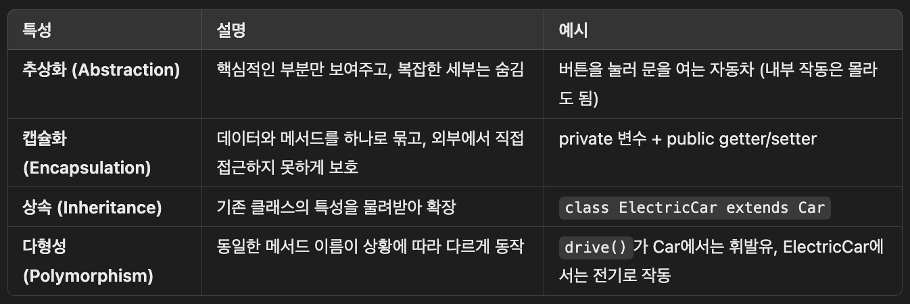

# TIL Template

## 날짜: 2025-04-01

### 스크럼
- 학습 목표 1 : 기술 면접 학습
- 학습 목표 2 : 기획

### 새로 배운 내용

**형상 관리 도구는 왜 사용하고 어떤 종류가 있는지 설명해 주세요**

- 형상 관리 도구란?
    
    형상 관리 도구(VCS: version control system)는 소프트웨어 개발, 문서 작업 등에 사용되는 도구. 
    
- 사용이유
    - 변경 이력을 추적
    - 여러 인원이 협업 시에 충돌을 방지하고, 작업을 효율적으로 관리
    - 백업 기능 → 문제가 생겼을 때 데이터 손실을 방지
- 종류
    - Git
        - 분산식 버전 관리 시스템 (DVCS)
        - 각 사용자의 컴퓨터에 로컬 저장소가 생성되고, 변경 사항은 로컬 저장소에서 커밋되어 원격 저장소에 저장
        - 대부분의 관리가 로컬에서 이루어저 속도가 빠름
        - 중앙 집중식 버전 관리 시스템에 비하여 복잡하고, 작업 내용 동기화 과정에서 충돌이 발생할 가능성이 높음
    - SVN
        - 중앙 집중식 버전 관리 시스템 (CVCS)
        - 중앙 서버에서 데이터를 관리하며 사용자는 중앙 서버에서 최신 버전의 데이터들을 체크아웃하여 작업한 후 변경사항을 다시 커밋
        - 모든 사용자들이 하나의 중앙 서버만을 관리하여, 관리가 쉽고 동기화 문제 없음
        - 사용자 수와 커밋의 빈도에 따라 서버의 부하가 크고, 브랜치와 머지 기능이 분산식 버전 관리 시스템에 비해 복잡함

<br>

**Git과 Github의 차이점**

- Git
    - **소프트웨어 개발 및 소스 코드 관리**에 사용
    : 로컬에서 브랜치를 통해 프로젝트의 기록을 관리한다
    - 다른 개발자와 **실시간으로 작업을 공유할 수 없다**  → 이를 개선하기 위해 github
- GitHub
    - 로컬 소스코드 업로드하고 쉽게 다른 개발자들과 공유하도록 하는 
    **클라우드 기반 호스팅 서비스**
    - Git의 기본 기능 + 확장 기능(PR, 이슈 관리, 코드 리뷰)
    

**📍** Git도 원격 저장소가 있고, 이를 다른 사용자과 실시간으로 공유하는 것 아니였나요?

→ Git은 원격 저장소를 **지원**하지만, **호스팅**은 하지 않는다.

원격 저장소를 어디에 둘지는 사용자가 직접 서버를 만들어서 구성해야한다. 직접 구성을 하였다면, 다른 사용자들과 **실시간으로 협업이 가능**

📍Git이 원래도 협업이 가능한데도 **GitHub 같은 서비스가 생긴 이유**

Git이 제공하는 원격 저장소 기능을 **웹에서 쉽게 사용할 수 있게** 만든 것이 GitHub이다. 사용자는 서버를 구성할 필요 없이, GitHub 계정만 있으면 저장소 생성과 협업 기능을 바로 이용할 수 있다.


**컴파일 언어와 인터프리터 언어의 차이에 대해 설명해 주세요**

- 컴파일 언어
    - 소스 코드 전체를 **컴파일러**가 한 번에 기계어 코드로 변환하여 실행
    - 실행속도, 메모리의 측면에서 유리
    - 예) C, C++
- 인터프리터 언어
    - **인터프리터**에 의해 한 줄씩 실행되며, 해당 플랫폼에서 동작
    - 개발속도, 유지보수, 동적인 환경에서 유리
    - 예) python, JavaScript
    

두 언어의 가장 큰 차이점 → **컴파일 과정**

- 처음 컴파일 과정 이후 해석된 파일로 재실행을 하기 때문에 여러번 반복적인 실행이 필요할때, 컴파일 언어가 빠르게 동작
- 컴파일 언어가 기계어에 조금 더 가까운 저수준 언어이기 때문에 더 적은 메모리로 동일한 코드를 수행할 수 있음
- 규모가 클 수록 컴파일 과정 자체가 시간이 오래걸리고, 저수준이기 때문에 사용이 어려움
- 컴파일 언어는 운영체제 마다 사용하는 기계어가 달라지기 때문에 별도의 처리가 필요함

<br>

**컴파일 과정**

4단계로 구성

1. Preprocessor
    
    소스 코드에서 `#include`, `#define`, 조건부 컴파일 등 **전처리 지시문**을 처리하는 단계
    
2. Complier
    
    전처리기로 확장된 소스 코드를 어셈블리어로 번역
    
3. Assembler
어셈블리어를 기계어(이진수)로 번역
이 단계에서 목적 파일을 생성하는데, 보통 여기까지를 컴파일이라고 부름
4. Linker
    
    전 단계에서 생성한 목적 파일 들을 하나로 합치는 과정
    운영체제에 맞춰 exe 파일(target 파일) 생성
    

→ 컴파일 단계를 거쳐 생성된 target 파일이 메모리에 올라가는 것을 **로딩**이라고 함

```css
main.c ──▶ [전처리기] ──▶ main.i
main.i ──▶ [컴파일러] ──▶ main.s
main.s ──▶ [어셈블러] ──▶ main.o
main.o + 라이브러리 ──▶ [링커] ──▶ main.exe
```

<br>

**객체 지향 프로그래밍에 대해서 설명하시오**

- 객체 지향 프로그래밍 이란?
    - **현실 세계를 모델링**하여 프로그래밍하는 방식입니다.
    - 프로그램을 **데이터(객체)**와 그 데이터를 처리하는 **동작(메서드)**의 모음으로 보는 개념
    
- 객체 지향의 4가지 특징
    - 상속, 캡슐화, 추상화, 다형성
    
  
    
    
    어떻게 구현?
    
    - 상속 → 자식 클래스가 부모 클래스를 `extends`
    - 캡슐화
        
        → 하나의 클래스에 속성과 메서드를 묶어 코드를 관리
        
        → 속성을 `private` 선언 + public getter/setter 으로 외부 접근 제한
        
    - 추상화 → 인터페이스를 제공하므로써, 세부 구현 내용은 숨김
    - 다형성 → 메소드 오버라이딩.

<br>

**객제 지향 5원칙 (SOLID)**

1. 단일 책임 원칙 (SRP)
    
    객체는 단 하나의 책임만을 가지도록 해야한다
    
2. 개방 - 폐쇄 원칙 (OCP)
    
    코드는 확장에는 열려 있어야 하고, 수정에는 닫혀 있어야 한다
    새로운 기능을 추가할 때, 기존 코드를 수정하지 않고 확장할 수 있어야 한다
    
3. 리스코프 치환 원칙 (LSP)
    
    자식 클래스가 부모 클래스 인스턴스를 대체하더라도 정삭동작 해야 한다
    
4. 인터페이스 분리 원칙 (ISP)
    
    여러 개의 작은 인터페이스를 통해 클라이언트가 사용하지 않는 인터페이스에 대한 의존도를 낮춰야 한다
    
5. 의존관계 역전 원칙 (DIP)
    
    상위 모듈(클라이언트)은 하위 모듈(구현)에 의존하지 말고, 추상(인터페이스)에 의존
    구체적인 부분일 수록 변경이 자주 일어나기 때문에


### 오늘의 회고
- 기획은 정말 쉽지 않다 ..
- 기술 면접 준비도 화이팅