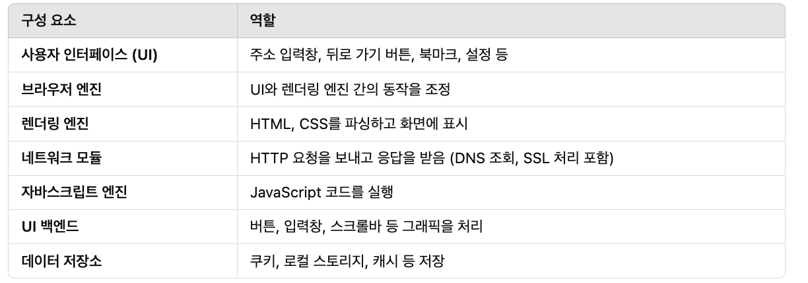

# TIL Template

## 날짜: 2024-02-05

### 스크럼
- 학습 목표 1 : 3주차 딥다이브

### 새로 배운 내용

**📍 Stateful 과 Stateless 의 차이에 대해 정리해주세요.  
HTTP는 Stateless 프로토콜이라고 합니다. Stateless의 의미는 무엇이며, 웹 애플리케이션은 사용자 상태나 세션을 유지하기 위해 어떤 방법들을 사용하나요?**  

|  | Stateful | Stateless |
| --- | --- | --- |
| 서버의 상태 관리 | 상태 유지 | 상태 없음 |
| 요청 처리 | 이전 요청의 영향을 받을 수 있음 | 모든 요청이 독립적으로 처리 |
| 서버 부하 | 높음 | 낮음 |
| 복구 용이성 | 서버 장애 시 세션 손실 위험 | 서버 장애 시에도 영향이 적음 |
| 확장성 | 낮음 | 높음 |

**Stateful (상태 유지)**

- 서버가 클라이언트의 이전 상태를 저장하는 방식
- 예시 : `TCP` 의 3-way handshaking 과정
  → 클라이언트와 서버의 연결 상태에 따라 응답이 다르다. 세션에 영향
- 사용이유
  - 클라이언트의 세션을 유지 (로그인)
  - 지속적인 연결이 필요한 경우 (채팅, 스트리밍)
- 문제점
  - 상태 정보를 서버가 가지고 있기 때문에, 서버의 부하가 크다
  - 여러 서버를 사용하는 경우, 세션 정보를 공유해야 한다

**Stateless (무상태)**

- 서버가 클라이언트의 이전 상태를 저장하지 않는 방식
- 예시 : `HTTP`, `UDP`
  → UDP 는 세션 상태와 상관없이 무작정 전송
  → HTTP 통신의 기본이 무상태
- 사용이유
  - 확장성과 성능이 중요한 경우 → **마이크로서비스 아키텍처**
  - 요청마다 독립적으로 처리되는 경우
- 문제점
  - 요청마다 부가정보를 줘야하므로, 더 많은 데이터가 소모된다.

**상태 유지와 확장성**  
- 수직 확장 : 기존 서버의 성능을 향상
- 수평 확장 : 서버 개수를 늘려 부하를 분산 → 상태 유지에 따라 수평 확장의 용이성이 다름

Stateless 는 서버가 세션 정보를 저장하지 않고, 각 요청이 독립적이기 때문에, 서버 갯수를 편하게 늘릴 수 있다.
반면, Stateful 은 서버 개수를 늘리려면, 서버 간 세션 공유를 위한 기술이 필요하다.

**Stateless와 JWT**
확장성과 유지보수성 등의 이점으로 최대한 Stateless를 지향하는 것이 유리하다. 하지만 로그인과 같이 상태를 유지해야 하는 경우들이 있다  
→ Stateless의 특징을 유지하면서 로그인 상태를 유지하게하는 기술이 바로 JWT !

**웹 애플리케이션은 사용자 상태나 세션을 유지하기 위해 어떤 방법들을 사용하나요?**
→ 웹 애플리케이션은 사용자 상태나 세션을 유지하기 위해, 브라우저의 쿠키(Cookie)와 서버의 세션 저장소(Session), 토큰 등을 사용합니다.

- 쿠키 기반 세션관리
  1. 쿠키(Cookie) : 브라우저(클라이언트) 스토리지에 저장되는 데이터 조각
  2. 요청 시 클라이언트가 쿠키를 포함하여 서버에게 전송
  3. `Set-Cookie` : 서버가 저장하려는 정보를 클라이언트에 쿠키로 저장하는데 사용하는 헤더

      ```jsx
      Set-Cookie: <cookie-name>=<cookie-value>
      ```

      ```jsx
      GET /dashboard HTTP/1.1
      Cookie: <cookie-name>=<cookie-value>
      ```
     서버는 응답 시, 유지할 세션 정보를 위의 방식으로 전달하여 클라이언트에 저장한다. 이후 클라이언트는 저장된 모든 쿠키를 헤더에 포함하여 요청을 보낸다  
 
    → 브라우저가 자동으로 쿠키를 전송해주며, 간단하게 구현되는 장점이 있다  
    → 하지만 XSS 공격으로 쿠키 탈취 가능성이 있어 `HttpOnly` 설정이 필요  
    → 로그인 상태 유지, 하루동안 다시 보지 않기 등에 사용  


- 서버 세션 저장소
  1. 세션을 서버 세션 저장소에 직접 저장
  2. 서버는 `Set-Cookie` 를 이용하여, 세션의 아이디를 클라이언트에게 알려준다

      ```jsx
      Set-Cookie: session_id=abc123; HttpOnly; Secure
      ```

      ```jsx
      GET /dashboard HTTP/1.1
      Cookie: session_id=abc123
      ```

     클라이언트는 요청 시, 자동으로 쿠키(세션 아이디)를 전송한다. 서버는 세션 저장소에서 받은 세션 아이디를 조회하여 세션을 유지한다.

  3. 저장소는 서버 메모리, DB 등
   → 기본은 메모리. 메모리의 휘발성 문제로 인해 하드 디스크나 데이터베이스도 보조로 사용가능

- **JWT** 기반
  1. 메모리 부담 문제와 확장성 제한의 문제를 해결하기 위해 토큰 등장
  2. **`JWT`** 구성 = 헤더 + 페이로드 + 서명
  3. 클라이언트가 `쿠키` 혹은 `로컬 스토리지`에 보관, 요청 시 서버에 전송

   장점  
   → Stateless 이므로, 서버 부하와 확장성 문제가 없다  
   → 서명을 통해, 데이터 위변조를 방지한다  
   → 토큰 자체로 인증의 기능이 포함되어 있어, 서버 측에서 따로 검증을 거치 않아도 된다

  
**📍브라우저의 동작방식에 대해 정리해보세요. (html, css, js 파일이 어떻게 웹서버로부터 어떻게 응답이 오는지 절차 정리)**
1. 브라우저의 구성요소

   

2. 동작 과정
    - 사용자가 브라우저에 URL 입력 (http 요청)
    - 서버 응답 (`html`, `css`, `js`파일)
    - 렌더링 엔진이 `html`과 `css`해석
    - `DOM` 과 `CSSOM` 생성
    - 렌더 트리 구성
    - 레이아웃 단계에서 각 요소의 위치 계산
    - 페인팅(Painting) 및 합성(Compositing) 후 화면에 렌더링


💡모르는 단어 정리
1. `DOM` : HTML 문서를 브라우저가 해석하여 만든 계층적인 트리
2. `CSSOM` : CSS 정보를 브라우저가 해석하여 만든 트리 구조  
   → `DOM` + `CSSOM` = 렌더 트리 생성
3. 렌더 트리 : `DOM`과 `CSSOM`을 결합하여 브라우저가 실제 화면에 표시할 요소들을 구성한 트리
4. 페인팅 : 렌더 트리의 요소들을 픽셀로 변환하여 화면에 그리는 과정
5. 합성 : 각 레이어를 조합하여 최종 화면을 만드는 과정


