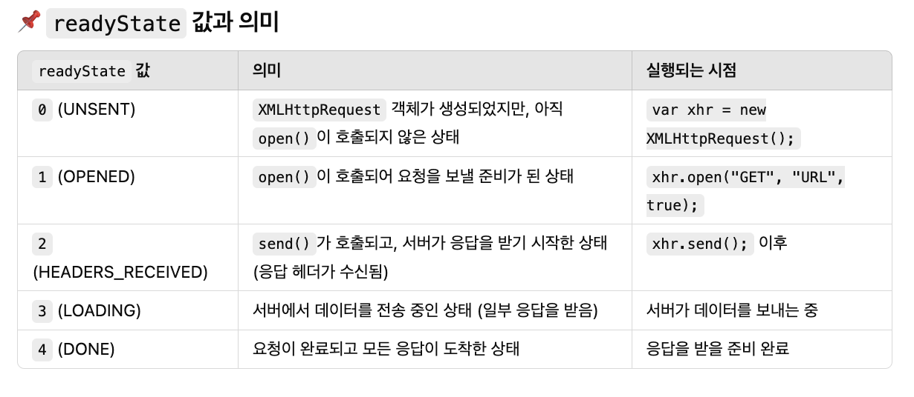
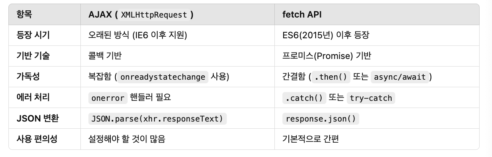

# TIL Template

## 날짜: 2024-02-21

### 스크럼
- 학습 목표 1 : 딥다이브
- 학습 목표 2 : 커뮤니티 프론트 개발 - 회원가입 페이지 구현

### 새로 배운 내용
**📍 fetch와 ajax의 차이에 대해 설명해주세요.**

**ajax (Asynchronous JavaScript and XML) 란?**
- 데이터를 비동기적으로 요청하고 응답을 처리하는 기술을 의미하는 개념적 용어

  ✅ AJAX를 구현하는데 사용되는 기술들

  1. **JavaScript** → 비동기 요청을 처리하는 역할
  2. **XMLHttpRequest (XHR) 객체 또는 fetch API** → 서버와 데이터를 주고받는 도구
  3. **HTML & CSS** → 웹 페이지를 구성하는 역할
  4. **JSON 또는 XML** → 서버와 데이터를 주고받는 데이터 형식
  5. **DOM 조작 (JavaScript 사용)** → 응답을 받아 웹페이지를 동적으로 업데이트

  → AJAX는 관용적으로 **`XMLHttpRequest(XHR)`**와 동일한 의미로 사용


`XMLHttpRequest` (XHR) 객체를 사용하여 서버와 통신  
JSON, XML, HTML 등 다양한 데이터 형식을 주고받을 수 있다

- 예시

```jsx
var xhr = new XMLHttpRequest();
xhr.open("GET", "https://jsonplaceholder.typicode.com/posts/1", true);

// 콜백 함수 구조 !
// xhr.onreadystatechange는 서버 응답이 도착할 때마다 실행되는 콜백 함수
xhr.onreadystatechange = function () {
  if (xhr.readyState === 4 && xhr.status === 200) {
    console.log(JSON.parse(xhr.responseText)); // 서버 응답 출력
  }
};

// 오류처리를 위한 별도의 이벤트 리스너
xhr.onerror = function () {
  console.error("네트워크 오류 발생");
};

xhr.send();

```

- `readyState` 의 종류

  

- 콜백기반?  
  `onreadystatechange` 는 **이벤트 기반의 콜백 함수**입니다.  
  즉, **특정한 이벤트(readyState 변경)가 발생했을 때 실행되도록 설정된 함수**


- 단점
  - 콜백 기반 → 프로미스를 지원하지 않아 콜백 중첩(Callback Hell) 발생하기 쉽다
  - API가 복잡

    → 개발자가 직접 요청 상태(`readyState`)를 체크해야 함  
    → 오류 처리가 불편:  `.onerror` 이벤트 리스너 따로 설정


**fetch 란?**

ES6에서 도입된 최신 API  
`fetch()` 함수는 프로미스를 기반으로 동작하여, 가독성 좋고 간결한 코드 작성가능  
비동기 통신을 더 간편하게 처리할 수 있으며, `async/await`와 함께 사용하면 더욱 직관적

- 예시

    ```jsx
    fetch("https://jsonplaceholder.typicode.com/posts/1")
      .then((response) => response.json()) // JSON 변환
      .then((data) => console.log(data)) // 데이터 출력
      .catch((error) => console.error("에러 발생:", error));
    ```

  프로미스 기반

  - `.then()` : 간결하게 결과 처리
  - `.catch()` : 간결하게 오류 처리

  → `요청상태 체크 x` : 알아서 결과가 매핑되어 실행

  → `오류 처리를 위한 별도의 로직 x`


**공통점**  
웹에서 서버와 비동기적으로 데이터를 주고받기 위해 사용되는 기술!

→ 서버에 요청을 보내고 응답을 기다리는 동안 다른 작업을 계속한다 (버튼 클릭, 화면 조작 등)

**차이점**  


### 오늘의 회고
- 어제부터 커뮤니티 프론트 개발이 좀 잘 되어가고 있다... 다행히 한시름 놓았다
- 오늘 딥다이브라서, 내가 정리한 이 내용에 대해 질문을 받았다.   
기술면접을 준비해볼 수 있었던 것 같아서 좋았따.. 더 연습하자
